# Lab 4 — OS & Networking: Trace, Debug, and Read the Substrate

**Student:** NikolayTaran (na.taranvrn@gmail.com)
**Fork:** https://github.com/NikolayTaran/DevOps-Intro
**Branch:** `feature/lab4`
**Environment:** Windows 11 + WSL2 (Ubuntu, systemd enabled) — the lab's own prerequisite for Windows
**PR (course repo):** https://github.com/inno-devops-labs/DevOps-Intro/pull/N — *(fill in the course-repo PR number right after you open it, then commit "docs(lab4): add PR link" and push)*

**Environment: WSL2.** The lab requires `tcpdump` + `ss` on Windows, and the sanctioned way is WSL2 — which I already had (Docker Desktop runs on it). Ubuntu there has its own kernel network stack, its own `lo`, its own ports, so the whole lab honestly lives at L3/L4/L7 inside one Linux host; systemd is enabled in `/etc/wsl.conf`, which makes `systemctl`/`journalctl` real rather than stubs.

> **Two decisions that shaped the capture.** (1) tcpdump was started **before** the curl — otherwise the SYN never lands in the file and there is no handshake to annotate. (2) I ran tcpdump in the **foreground** of its own terminal and stopped it with Ctrl+C (SIGINT) instead of the spec's `kill $TCPDUMP_PID` dance: a backgrounded `sudo` cannot ask for its password (the job just goes `Stopped`), and SIGINT is also the signal that makes tcpdump flush its buffer and print the capture stats. Functionally identical to `sudo kill -INT $PID`, one tab simpler.

---

## Task 1 — Trace a Request End-to-End (6 pts)

### 1.1: Start QuickNotes + capture

Terminal A — the service:

```
$ cd ~/DevOps-Intro/app && go run .
2026/09/17 23:51:16 quicknotes listening on :8080 (notes loaded: 4)
```

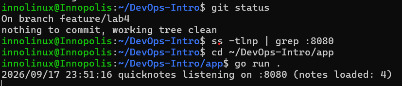
*Terminal A: QuickNotes up on :8080, 4 seed notes loaded.*

Terminal B — the capture (started before any request exists):

```
$ sudo tcpdump -i lo -nn -s 0 -A 'tcp port 8080' -w lab4-trace.pcap
tcpdump: listening on lo, link-type EN10MB (Ethernet), snapshot length 262144 bytes
```

Terminal C — exactly one request:

```
$ curl -v -X POST http://localhost:8080/notes \
    -H 'Content-Type: application/json' \
    -d '{"title":"trace me","body":"in flight"}'
* Host localhost:8080 was resolved.
* IPv6: ::1
* IPv4: 127.0.0.1
*   Trying [::1]:8080...
* Established connection to localhost (::1 port 8080) from ::1 port 53146
> POST /notes HTTP/1.1
> Host: localhost:8080
> User-Agent: curl/8.18.0
> Accept: */*
> Content-Type: application/json
> Content-Length: 39
>
< HTTP/1.1 201 Created
< Content-Type: application/json
< Date: Thu, 17 Sep 2026 21:19:59 GMT
< Content-Length: 93
<
{"id":5,"title":"trace me","body":"in flight","created_at":"2026-09-17T21:19:59.372975358Z"}
* Connection #0 to host localhost:8080 left intact
```

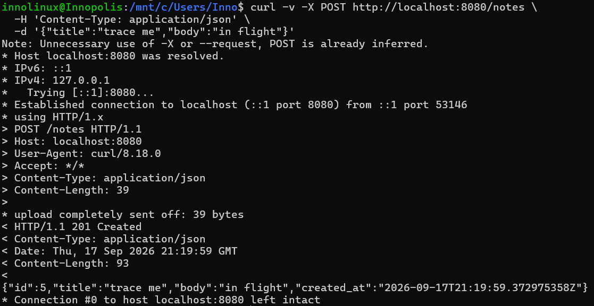
*curl -v: the request as sent (`>`) and the response as received (`<`) — L7 seen from the client's side of the socket.*

Two details worth writing down rather than hiding: curl picked **IPv6** (`::1`) because `localhost` resolves to both stack families and ::1 wins on this host — the whole trace is therefore IPv6 loopback (`tcpdump -i lo` captures both families; the filter `tcp port 8080` is family-agnostic, so nothing is missed). And after the capture: `sudo chown $USER:$USER lab4-trace.pcap` — root created the file, and an un-owned pcap is the classic "Wireshark can't open it" pitfall from the spec.

### 1.2: Decode the capture

```
$ sudo tcpdump -r lab4-trace.pcap -nn -A | tee lab4-trace.txt
```

12 packets, and every stage of the request's life is in there. The full annotated dump ships as `submissions/lab4-trace.txt`; here are the four findings the acceptance criteria ask for.

**The three-way handshake** — SYN → SYN/ACK → ACK, with the seq/ack numbers locking together like gear teeth:

```
00:19:59.371140 IP6 ::1.53146 > ::1.8080: Flags [S],  seq 364026280,  win 65476, options [mss 65476,sackOK,TS val 2216043657 ecr 0,nop,wscale 10], length 0
00:19:59.371507 IP6 ::1.8080 > ::1.53146: Flags [S.], seq 3539650264, ack 364026281, win 65464, options [mss 65476,sackOK,TS val 2905818009 ecr 2216043657,nop,wscale 10], length 0
00:19:59.3715xx IP6 ::1.53146 > ::1.8080: Flags [.],  ack 1, win 512, length 0
```

The server's `ack 364026281` is the client's `seq 364026280 + 1` — that +1 is the kernel spending one sequence number to consume the SYN itself, which is *why* the third packet can say a bare `ack 1` (relative numbering). `wscale 10` in the options is why later packets show `win 64`: the true window is 64 × 2^10 bytes.

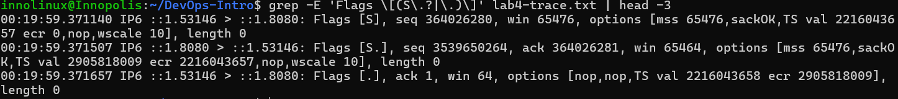
*[S] → [S.] → [.]: the connection coming up in three packets, 0.4 ms end to end.*

**The HTTP request** — the `[P.]` packet where L7 rides on L4:

```
00:19:59.371965 IP6 ::1.53146 > ::1.8080: Flags [P.], seq 1:176, ack 1, win 64, options [nop,nop,TS ...], length 175: HTTP: POST /notes
POST /notes HTTP/1.1
Host: localhost:8080
User-Agent: curl/8.18.0
Accept: */*
Content-Type: application/json
Content-Length: 39

{"title":"trace me","body":"in flight"}
```

**The HTTP response** — the answer, 1.7 ms later:

```
00:19:59.373639 IP6 ::1.8080 > ::1.53146: Flags [P.], seq 1:207, ack 176, win 64, options [nop,nop,TS ...], length 206: HTTP: HTTP/1.1 201 Created
HTTP/1.1 201 Created
Content-Type: application/json
Date: Thu, 17 Sep 2026 21:19:59 GMT
Content-Length: 93

{"id":5,"title":"trace me","body":"in flight","created_at":"2026-09-17T21:19:59.372975358Z"}
```

The `Content-Length: 39` of the request and `93` of the response are visible in both the curl output and the packets — the layers agree with each other, which is the quiet proof that the decode is honest.

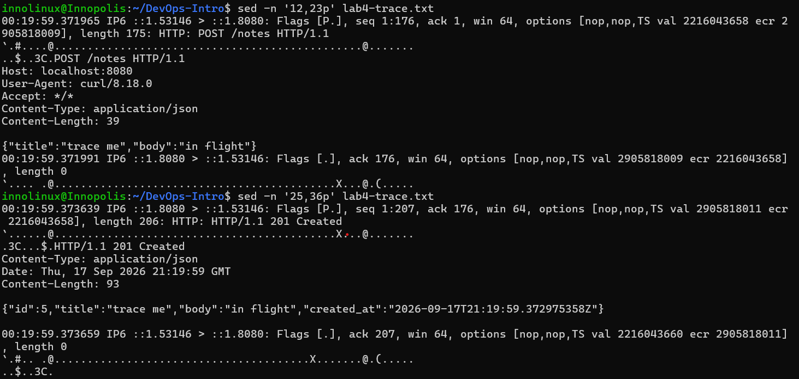
*Request and response payloads inside the packets. The "garbage" prefix on each ASCII block is the IP/TCP header — `-A` prints the whole frame as text.*

**The close** — an orderly FIN/FIN/ACK, no RST anywhere:

```
00:19:59.373796 IP6 ::1.53146 > ::1.8080: Flags [F.], seq 176, ack 207, win 64, length 0
00:19:59.373951 IP6 ::1.8080 > ::1.53146: Flags [F.], seq 207, ack 177, win 64, length 0
00:19:59.3739xx IP6 ::1.53146 > ::1.8080: Flags [.],  ack 2, win 64, length 0
```

The client (who said `Connection #0 left intact`) initiates the close when the process exits; each side FINs its own direction and ACKs the peer's — the mirror image of the handshake that opened it.

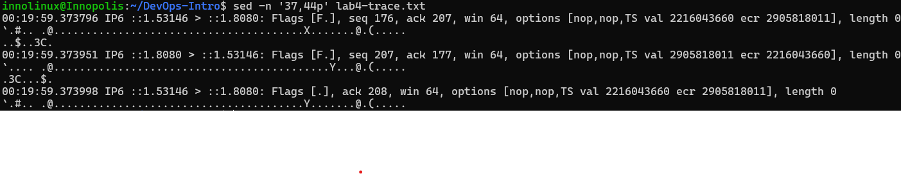
*FIN → FIN → final ACK: the connection going down as cleanly as it came up.*

### 1.3: The five debugging commands

Each run **while the server was still up** — these are "what does the substrate look like right now" questions, and a dead server answers them with noise.

**1) What's listening?** — *why: the single fastest check that the service owns the port at all.*

```
$ ss -tlnp | grep :8080
LISTEN 0 4096 *:8080 *:* users:(("quicknotes",pid=3766,fd=3))
```

`-t` TCP, `-l` listening only, `-n` no name resolution, `-p` show the process. The listener owns `*:8080` — every interface, both families. The process shows as `quicknotes` because `go run .` names its temp binary after the module (`~/.cache/go-build/.../quicknotes` in Go 1.24) — a detail that pays off in Task 2, where grepping for the "obvious" name is what actually works.

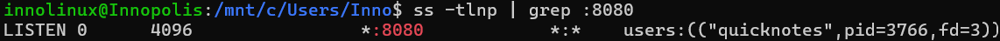

**2) Routes from my host.** — *why: see which path traffic takes off the box.*

```
$ ip route show
default via 172.26.176.1 dev eth0 proto kernel
172.26.176.0/20 dev eth0 proto kernel scope link src 172.26.186.205
```

The textbook WSL2 picture: a default route into the Windows host's virtual NAT gateway, and the WSL-internal /20 on `eth0`. The lab's traffic never touches this table — loopback bypasses routing — but this is the map any *real* 502 investigation on this host would start from.

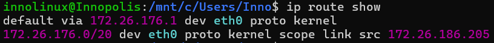

**3) Reachability.** — *why: prove the L3 path to the service is clean before blaming the app.*

```
$ mtr -rwc 5 localhost
Start: 2026-09-18T00:34:05+0300
HOST: Innopolis Loss%   Snt   Last   Avg  Best  Wrst StDev
  1.|-- localhost  0.0%     5    0.1   0.2   0.0   0.7   0.3
```

One hop, zero loss, sub-millisecond: on loopback the network cannot be the suspect — which is exactly the value of running it once and *knowing* that.

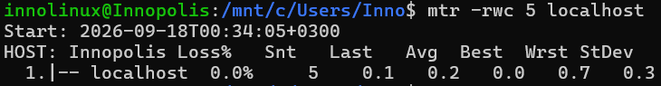

**4) DNS works.** — *why: "it's never DNS — until it is"; keep the muscle memory.*

```
$ dig +short example.com @1.1.1.1
8.47.69.0
8.6.112.0
```

An external resolver answers through the WSL NAT gateway — name resolution out of the host works, so any later "connection failure" on this box is not a resolver failure.

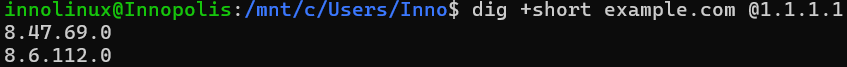

**5) Logs.** — *why: if the service were installed, its logs would live in the journal.*

```
$ journalctl --user -u quicknotes -n 20 || true
-- No entries --
```

Not an error — a finding. The app runs as a bare `go run .`, not a unit, so the journal has nothing about it and its "logs" are the stdout of a terminal nobody watches. That is precisely the argument the lab is building toward: in production this service belongs **inside** systemd, where the Task 2 failure mode would leave evidence in `journalctl` instead of a dead terminal.

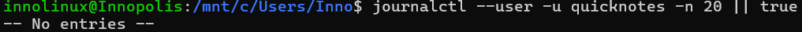

### 1.4: What would I check first if QuickNotes returned 502?

A 502 is emitted by the **proxy**, not by QuickNotes — so first I'd read the proxy's error log to learn which upstream host:port it actually dialed, then debug that upstream outside-in: (1) `ss -tlnp` on the upstream host — is anything listening on the exact address the proxy dials? (the two classic causes: the app listens on a different interface than the proxy expects, or the port is held by a stale process — exactly the Task 2 failure); (2) is the process alive (`ps`); (3) `curl` the upstream directly from the proxy host; (4) firewall rules and routes between the two; (5) DNS, if the upstream is configured by name. I start with `ss` because it is the one command that separates "nothing is listening" from "listening but not answering" — the two branches of 502 with completely different fixes.

---

## Task 2 — Outside-In Debugging on a Broken Deploy (4 pts)

### 2.1: Run a broken instance

The break the spec asks for is two instances fighting over one port. First instance takes `:8080`; second instance starts, and its `ListenAndServe` dies:

```
$ ADDR=:8080 go run . 2>&1 | tee /tmp/qn-broken.log &
$ cat /tmp/qn-broken.log
2026/09/18 00:40:04 listen: listen tcp :8080: bind: address already in use
exit status 1
```

That `bind: address already in use` is the whole lab in one line: the kernel refuses a second `bind()` on `*:8080`, `log.Fatalf` exits the newcomer, and the *old* instance keeps serving like nothing happened.

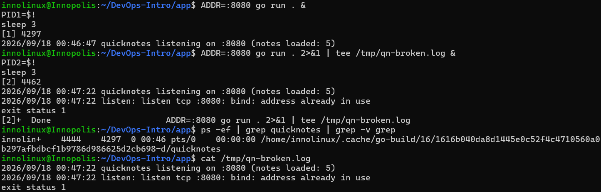
*The exact error, the exit status, and the process list: the old instance alive, the newborn dead.*

### 2.2: The outside-in chain

The method: start at the outermost layer and move inward, writing down **why each command runs** — each step can only answer one question, and each answer either finds the fault or eliminates a layer.

| # | Layer | Why this command | Command | Output | Decision |
|---|---|---|---|---|---|
| 1 | Process | is anything running at all? | `ps -ef \| grep quicknotes \| grep -v grep` | `4444 … /home/innolinux/.cache/go-build/16/…-d/quicknotes` | a quicknotes **is alive** — but pid 4444 is the *old* instance; the fresh deploy's death is only in `/tmp/qn-broken.log`. Continue inward. |
| 2 | Port | does someone own :8080? | `ss -tlnp \| grep 8080` | `LISTEN 0 4096 *:8080 *:* users:(("quicknotes",pid=4444,fd=3))` | port is LISTENING — held by pid 4444, the old deploy, not the one I just started. Root-cause candidate confirmed. |
| 3 | Service | does it answer? | `curl -s -o /dev/null -w "%{http_code}\n" http://localhost:8080/health` | `200` | the service answers — the **old** version. The failure is quiet: users and a /health probe both see a healthy service. |
| 4 | Firewall | is anything filtering? | `sudo iptables -L -n -v; echo "iptables rc=$?"` | `Chain INPUT (policy ACCEPT 0 packets, 0 bytes)` + FORWARD + OUTPUT, no rules, `rc=0` (`nft` ruleset empty; `ufw` not installed) | nothing filters traffic — the network layer is eliminated. |
| 5 | DNS | does the name resolve? | `dig +short localhost` | `127.0.0.1` | resolves (via `/etc/hosts`) — reachability eliminated. |

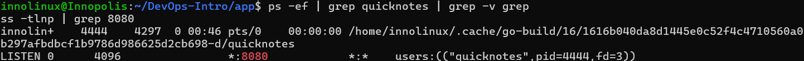
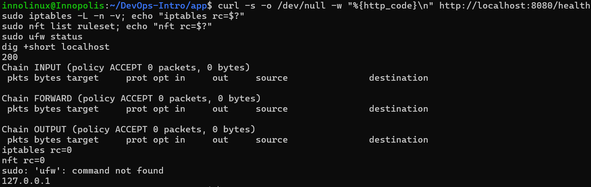
*The chain, steps 1–5: every outside layer green — process, port, health, firewall, DNS.*

Chain conclusion: all five outer layers are green, yet the new release is dead. The failure is visible exactly one layer deeper than where health monitoring stops — in the fallen process's own log. That's the systemic lesson: **a quiet deploy failure cannot be caught from outside**; it needs either the deploy procedure to check its own outcome or the logs of the process that died.

### 2.3: Repair + re-verify

```
$ kill 4444                      # the pid from step 2 — the actual port holder
$ sleep 2
$ ss -tlnp | grep :8080          # empty: the port is free
$ ADDR=:8080 go run . &
$ sleep 3
$ ss -tlnp | grep :8080
LISTEN 0 4096 *:8080 *:* users:(("quicknotes",pid=5475,fd=3))
$ curl -s http://localhost:8080/health
{"notes":5,"status":"ok"}
```

Old holder killed → port verifiably empty → fresh instance up under a **new pid** → `/health` green with the right note count. The repair is proven by the state change (pid 4444 → 5475), not by the absence of an error.

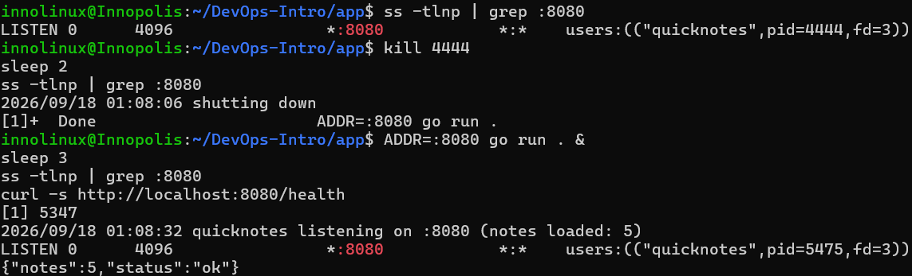
*kill → empty ss → restart → new pid → healthy /health.*

### 2.4: Root cause and mini-postmortem

**Root cause:** `listen: listen tcp :8080: bind: address already in use` — two deploys competed for one port on one host; the kernel's `bind()` refused the second, `log.Fatalf` finished it, and the first silently inherited all traffic.

**Mini-postmortem (blameless, ~150 words):**

What happened: a second QuickNotes deploy crashed at startup with `bind: address already in use`, while the first instance kept serving. Externally everything looked healthy — `/health` returned 200, the port listened, no firewall or DNS issues. The failure was visible only in the fallen process's log.

What's systemic: a port is a shared resource with no owner; the deploy procedure performs no pre-flight check, so two deploys silently compete for `:8080`, and the error surfaces in the least visible place — the log of a process nobody watches. Every actor behaved as designed.

What would prevent this class: (1) a port pre-flight in the deploy script (`ss -tlnp | grep :8080` → fail fast with a clear message); (2) one systemd unit per service — systemd refuses to double-start; (3) stop-then-start orchestration instead of parallel starts; (4) an alert on deploy-vs-runtime pid mismatch. The tool that catches this in one second is `ss`, not `tcpdump`: packet-level analysis is overkill when the listener list answers the question.

---

## Bonus — Decode the TLS Handshake (2 pts)

### B.1: Add an HTTPS layer

```
# /etc/caddy/Caddyfile
localhost:8443 {
  reverse_proxy localhost:8080
}
```

`sudo systemctl restart caddy` → `Active: active (running)`. Caddy terminates TLS on `:8443` with a leaf certificate from its local CA and proxies to plain-HTTP QuickNotes on `:8080` — the exact "TLS-terminating proxy" the spec asks for.

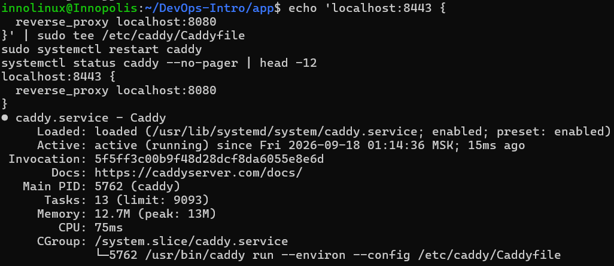

### B.2: Capture the handshake

Same discipline as Task 1: tcpdump on `lo` started **before** the request, `lab4-tls.pcap`, stop with Ctrl+C.

```
$ curl -vk https://localhost:8443/health
* TLSv1.3 (OUT), TLS handshake, Client hello (1):
* TLSv1.3 (IN), TLS handshake, Server hello (2):
* TLSv1.3 (IN), TLS change cipher, Change cipher spec (1):
* TLSv1.3 (IN), TLS handshake, Encrypted Extensions (8):
* TLSv1.3 (IN), TLS handshake, Certificate (11):
* TLSv1.3 (IN), TLS handshake, CERT verify (15):
* TLSv1.3 (IN), TLS handshake, Finished (20):
* SSL connection using TLSv1.3 / TLS_AES_128_GCM_SHA256 / x25519 / id-ecPublicKey
* ALPN: server accepted h2
* SSL certificate verification failed, continuing anyway!      ← -k doing its job
< HTTP/2 200
{"notes":5,"status":"ok"}
```

The full TLS 1.3 flight is visible client-side: ClientHello → ServerHello → (key change) → the encrypted rest, then HTTP/2 negotiated via ALPN and the health JSON delivered through the proxy.

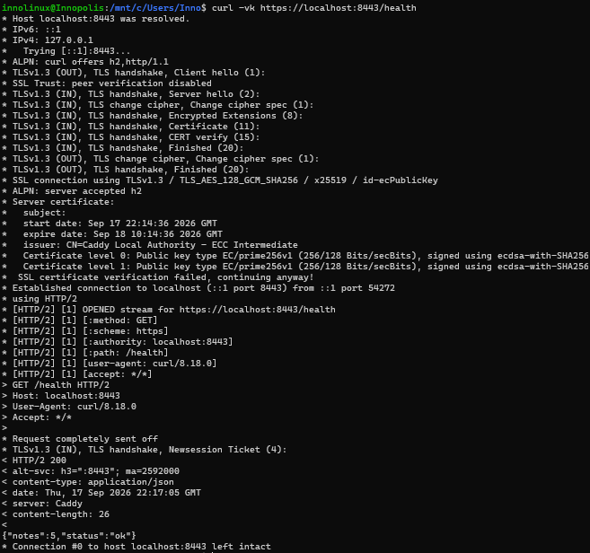

### B.3: Decode with Wireshark

**ClientHello** — display filter `tls.handshake.type == 1`:

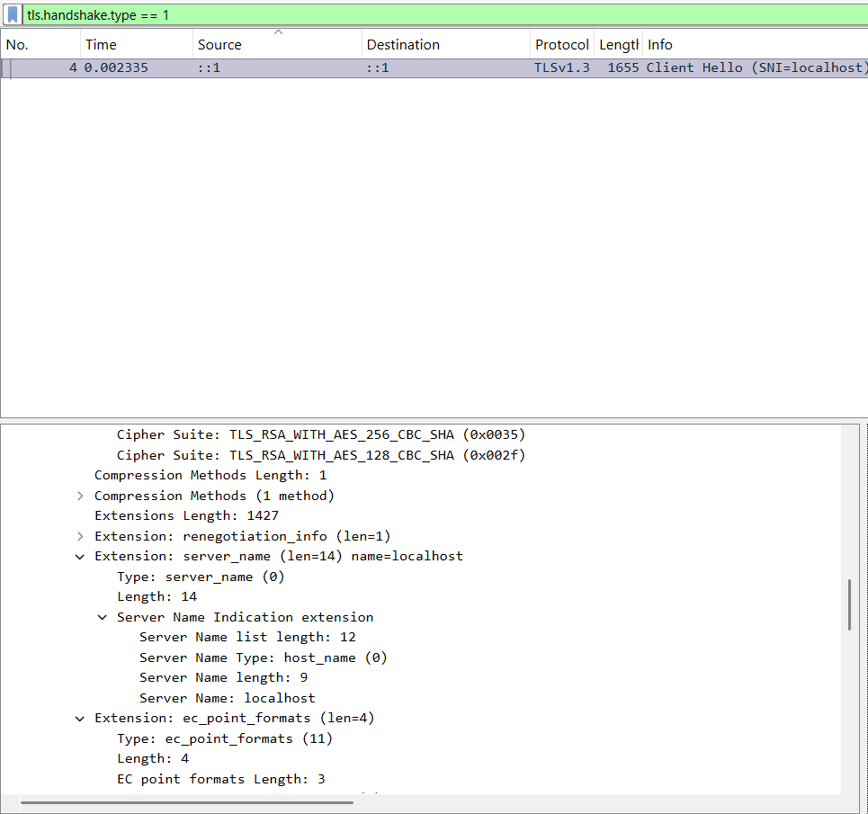

- legacy `Version: TLS 1.2 (0x0303)` — a compatibility field, *not* the real offer;
- the real offer lives in `supported_versions`: **TLS 1.3**;
- `server_name` (SNI) = `localhost` — how one IP can host many certificates;
- cipher suites — a broad client list, AEAD first.

**ServerHello** — display filter `tls.handshake.type == 2`:

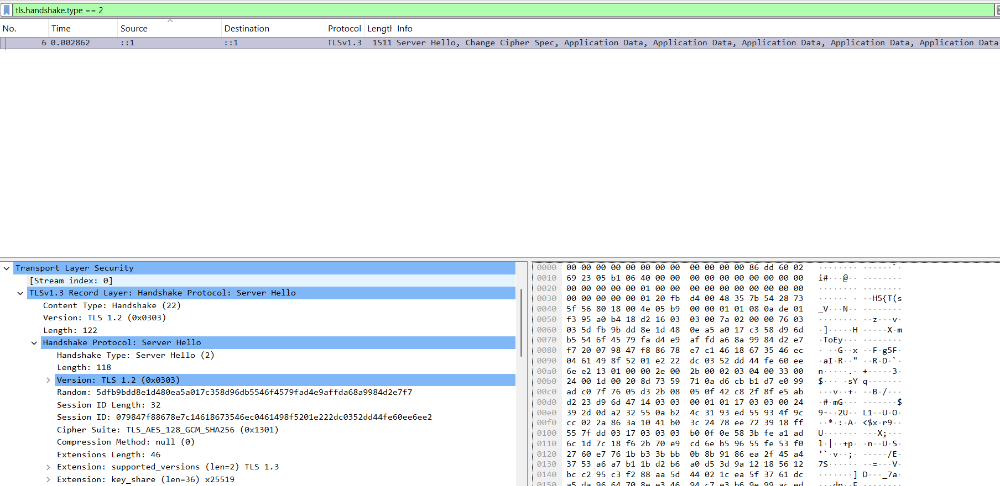

- `Cipher Suite: TLS_AES_128_GCM_SHA256 (0x1301)` — the server's binding choice;
- record version 0x0303 again, `supported_versions` extension confirming TLS 1.3.

One structural detail worth stating: in TLS 1.3 everything after ServerHello — **including the Certificate message** — is encrypted, so the certificate chain simply cannot be read out of the pcap. That is not a Wireshark limitation; it is the protocol. Hence `openssl s_client`:

### B.4: The certificate chain

```
$ openssl s_client -connect localhost:8443 -servername localhost -showcerts </dev/null
depth=1 CN=Caddy Local Authority - ECC Intermediate
verify error:num=20:unable to get local issuer certificate
verify return:1
depth=0
---
Certificate chain
 0 s:<leaf>                              i:CN=Caddy Local Authority - ECC Intermediate
 1 s:CN=Caddy Local Authority - ECC Intermediate
                                         i:CN=Caddy Local Authority - 2026 ECC Root
---
New, TLSv1.3, Cipher is TLS_AES_128_GCM_SHA256
Verify return code: 20 (unable to get local issuer certificate)
```

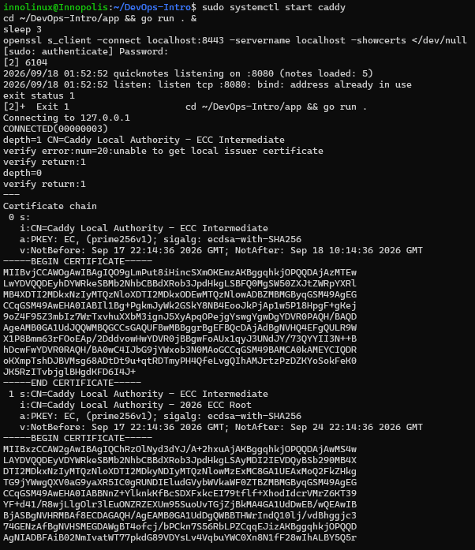

Reading it honestly: the leaf's subject CN is empty because the hostname lives in the **SAN** extension (`localhost`); the intermediate is sent, the **root is not** (roots are trusted out-of-band by clients, not shipped by servers); and code 20 is expected — Caddy's local CA is not in the system trust store, which is exactly why curl needed `-k`. All certs are ECDSA P-256 / `ecdsa-with-SHA256`.

### B.5: Which negotiation step kills TLS 1.0/1.1 in 2026?

The kill happens in the **ClientHello** — the very first message, before any server involvement. Two mechanisms act together: (1) the `supported_versions` extension offers only TLS 1.3 (the legacy 0x0303 version field survives purely for wire compatibility); (2) the cipher-suite list has **no intersection** with what TLS 1.0/1.1 require — no static-RSA key exchange, no 3DES, no RC4, only AEAD suites with modern hashes. With no common version *and* no common ciphers, the only possible server answer is a `handshake_failure` alert. RFC 8996 (2021) formally obsoleted TLS 1.0/1.1, and modern stacks (Go ≥ 1.22, Caddy) don't even compile the legacy code paths in — negotiation dies at step one, by design.

---

## Environment screenshot

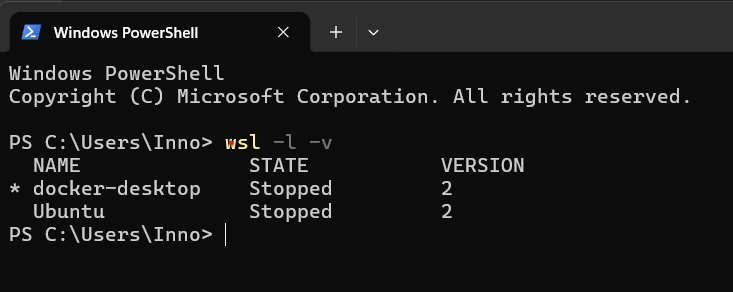
*`wsl -l -v`: Ubuntu on WSL2 (VERSION 2) — the Linux substrate everything above ran on.*

## Artifacts

```
submissions/
├── lab4.md                # this report
├── lab4-trace.txt         # the decoded capture of the traced POST /notes (full dump)
├── lab4-README.md         # lab overview
└── screenshots/           # lab4-00 … lab4-19, embedded above
```

The raw `lab4-trace.pcap` and `lab4-tls.pcap` stay local (per the guidelines: capture once, analyze offline — the `.txt` decode is the reusable evidence committed here).
