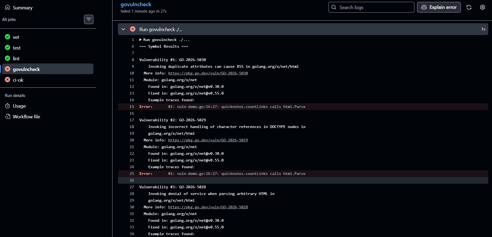
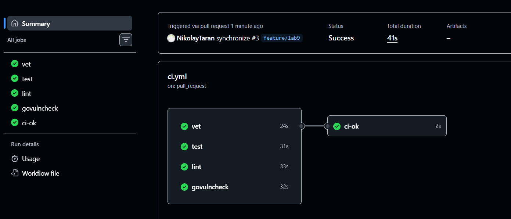

# Lab 9 — DevSecOps: Scan QuickNotes with Trivy + ZAP

**Student:** NikolayTaran (na.taranvrn@gmail.com)
**Fork:** https://github.com/NikolayTaran/DevOps-Intro
**Branch:** `feature/lab9` (cut from `feature/lab8` — carries the Lab 6 hardened image and the Lab 8 monitoring stack)
**PR (course repo):** https://github.com/inno-devops-labs/DevOps-Intro/pull/1733
**Host:** Windows 11 · Docker Desktop — every scanner runs on the host through its pinned container image
**Base:** `quicknotes:lab6` (multi-stage build, distroless static nonroot, healthcheck subcommand — Lab 6)
**Tools (pinned, never `:latest`):** Trivy `0.59.1` · ZAP `2.16.0` · govulncheck `v1.1.4` · golangci-lint `v2.5.0`
**Date:** 2026-10-06

---

## 1. What the lab requires

| # | Requirement | Where |
|---|-------------|-------|
| T1.1 | Four scans — image, filesystem, config, SBOM — Trivy pinned | §2.1–§2.6 |
| T1.2 | Every HIGH/CRITICAL triaged: FIX / ACCEPT / WATCH / FALSE POSITIVE | §2.5 |
| T1.3 | Design questions a–d | §2.7 |
| T2.1 | ZAP baseline, passive only, pinned, reports saved | §3.1 |
| T2.2 | Every ZAP finding triaged | §3.2 |
| T2.3 | ≥ 1 finding fixed in code: middleware, all routes, guarded by a test | §3.3 |
| T2.4 | Re-scan proves the finding is gone | §3.4 |
| T2.5 | Design questions e–g | §3.5 |
| B.1–B.2 | govulncheck as a CI PR gate + red→green demonstration | §4.1–§4.3 |
| B.3 | Design questions h–j | §4.4 |

All scan artifacts live in `submissions/lab9-artifacts/`, screenshots in `submissions/screenshots/`.

---

## 2. Task 1 — Trivy: image + filesystem + config + SBOM

### 2.1 Tool pinning and scan chronology

All four scans ran through the pinned container `aquasec/trivy:0.59.1` (Docker socket / repo root mounted into the container — never `:latest`):

```
trivy image --severity HIGH,CRITICAL quicknotes:lab6
trivy fs    --severity HIGH,CRITICAL .
trivy config app
trivy image --format cyclonedx --output sbom-quicknotes.cdx.json quicknotes:lab6
```

The artifacts tell a before → fix → after story, so their chronology matters:

1. `trivy-image.txt` — the image **as Lab 8 shipped it** (builder `golang:1.24-alpine` → binary stdlib Go 1.24.13).
2. **FIX 1** — `app/Dockerfile`: builder bumped `golang:1.24-alpine` → `golang:1.26-alpine`.
3. `trivy-image-after.txt`, `trivy-fs.txt`, `trivy-config.txt`, `sbom-quicknotes.cdx.json` — re-scan at the mid-demo point (the deliberate, temporary `golang.org/x/net v0.30.0` demo pin of §4.2 is still in `go.mod`).
4. **FIX 2** — revert of the demo pin (§4.3).
5. `trivy-image-final.txt` — the final image: **Total: 0 (HIGH: 0, CRITICAL: 0)**.

### 2.2 Image scan — before (trivy-image.txt)

```
quicknotes:lab6 (debian 12.15)
==============================
Total: 0 (HIGH: 0, CRITICAL: 0)

quicknotes (gobinary)
=====================
Total: 19 (HIGH: 19, CRITICAL: 0)

│ stdlib │ CVE-2026-25679 │ HIGH │ fixed │ v1.24.13 │ 1.25.8, 1.26.1 │ net/url: Incorrect parsing of IPv6 host literals …
```

19 HIGH findings, **all in the Go 1.24.13 standard library** (mostly DoS-class parser bugs: net/url, crypto/x509, crypto/tls, net/http, mime, net/mail). The distroless OS layer (debian 12.15) is clean: **0**. Full table: `submissions/lab9-artifacts/trivy-image.txt`.

### 2.3 Filesystem scan (trivy-fs.txt)

```
app/go.mod (gomod)
==================
Total: 6 (HIGH: 6, CRITICAL: 0)

│ golang.org/x/net │ CVE-2024-45338 │ HIGH │ fixed │ v0.30.0 │ 0.33.0 │ golang.org/x/net/html: Non-linear parsing of case-insensitive content …

.vagrant/machines/default/virtualbox/private_key (secrets)
==========================================================
Total: 1 (HIGH: 1, CRITICAL: 0)

HIGH: AsymmetricPrivateKey (private-key)
```

Two finding classes: the same 6 `x/net` CVEs the image scan sees (module level, straight from `go.mod`) and one "secret". Full output: `submissions/lab9-artifacts/trivy-fs.txt`.

### 2.4 Config (misconfig) scan (trivy-config.txt)

```
app/Dockerfile (dockerfile)
===========================
Tests: 28 (SUCCESSES: 27, FAILURES: 1)
Failures: 1 (UNKNOWN: 0, LOW: 1, MEDIUM: 0, HIGH: 0, CRITICAL: 0)

AVD-DS-0026 (LOW): Add HEALTHCHECK instruction in your Dockerfile
```

### 2.5 Triage — every HIGH/CRITICAL has a disposition

**Dependency/container findings (image + fs scans):**

| Findings | Where | Severity | Disposition | Action and evidence |
|---|---|---|---|---|
| 19 × stdlib Go 1.24.13: CVE-2026-25679, -27145, -32280, -32281, -32283, -33811, -33814, -33818, -39820, -39821, -39822, -39836, -42499, -42504, -56853, -56858, -56859, -56860, -56862 | image scan (gobinary) | 19 HIGH | **FIX** | Builder image bumped `golang:1.24-alpine` → `golang:1.26-alpine` in `app/Dockerfile` (this PR). Verified: the stdlib section of the after-scan is empty (`trivy-image-after.txt`) |
| 6 × golang.org/x/net v0.30.0: CVE-2024-45338 (GO-2024-3333), CVE-2026-25681, CVE-2026-27136, CVE-2026-33814, CVE-2026-39821, CVE-2026-46600 | image scan (gobinary) + fs scan (gomod) | 6 HIGH | **FIX** | The pin was temporary (the bonus demo, §4.2). Fix commit `fix(security): drop temporary vuln-dep pin (golang.org/x/net v0.30.0, GO-2024-3333)` deletes `vuln-demo.go` / `vuln-reach.go` and runs `go mod tidy`, so the module leaves `go.mod` entirely. Verified: `trivy-image-final.txt` → Total: 0 (HIGH: 0, CRITICAL: 0) |
| `AsymmetricPrivateKey` in `.vagrant/machines/default/virtualbox/private_key` | fs scan (secrets) | 1 HIGH | **FALSE POSITIVE** | Vagrant's auto-generated default key of the local lab VM. `.vagrant/` is a runtime directory — ignored and **not tracked by git** (`git ls-files .vagrant` is empty) — so the repository ships no credential. The finding disappears once the lab VM is destroyed |

CVE-2024-45338 deserves a note: it is simultaneously a module-level Trivy finding (above) and the *reachable* govulncheck finding demonstrated in §4.2 — the same CVE, two scanners, two different questions.

**Config scan:** no HIGH/CRITICAL → nothing in the required triage scope. The single LOW is documented anyway: **AVD-DS-0026 (add HEALTHCHECK) — ACCEPT.** The healthcheck exists, but lives in `compose.yaml`: it calls the app's own `healthcheck` subcommand, because distroless has no shell for a classic curl-based check. Keeping it in the deployment unit avoids duplicating it in the image; re-evaluate if the image is ever distributed standalone (next image change).

### 2.6 SBOM (first 30 lines of sbom-quicknotes.cdx.json)

```json
{
  "$schema": "http://cyclonedx.org/schema/bom-1.6.schema.json",
  "bomFormat": "CycloneDX",
  "specVersion": "1.6",
  "serialNumber": "urn:uuid:268e38e9-5452-411b-a460-ec62a1d6583d",
  "version": 1,
  "metadata": {
    "timestamp": "2026-10-06T14:53:00+00:00",
    "tools": {
      "components": [
        {
          "type": "application",
          "group": "aquasecurity",
          "name": "trivy",
          "version": "0.59.1"
        }
      ]
    },
    "component": {
      "bom-ref": "pkg:oci/quicknotes@sha256%3Aaadafe1c69709673a015d9bae5847dc3adf3c6489ef348ff48923db2097fb313?arch=amd64&repository_url=index.docker.io%2Flibrary%2Fquicknotes",
      "type": "container",
      "name": "quicknotes:lab6",
      "purl": "pkg:oci/quicknotes@sha256%3Aaadafe1c69709673a015d9bae5847dc3adf3c6489ef348ff48923db2097fb313?arch=amd64&repository_url=index.docker.io%2Flibrary%2Fquicknotes",
      "properties": [
        {
          "name": "aquasecurity:trivy:DiffID",
          "value": "sha256:114dde0fefebbca13165d0da9c500a66190e497a82a53dcaabc3172d630be1e9"
        },
        {
          "name": "aquasecurity:trivy:DiffID",
          "value": "sha256:35b5ba6e08cdd034b8d1920f9c7203e5d66f258e1915f164a01de0af14f34710"
        },
```

CycloneDX 1.6, generated by Trivy 0.59.1 against the mid-demo image — deliberately captured while the temporary `x/net v0.30.0` pin was still in place, so the component list contains exactly the component §2.5 removes; the final image's SBOM differs only by the absence of that component. This is the Log4Shell workflow of design question (d): "are we affected by CVE-X?" is answered by grepping one committed file, not by rebuilding the world.

### 2.7 Design questions a–d

**a) CVE severity is one input, not the answer — what else matters?**
Severity is a population-level label; triage is instance-level. What actually moves the decision: **reachability** (does our call graph touch the vulnerable function? — the whole premise of govulncheck, §4), **exposure** (internet-facing vs internal-only, authenticated vs anonymous), **exploit maturity** (public exploit / CISA KEV / EPSS score vs a theoretical bug), **impact context** (which data sits behind the component, blast radius), and **fix economics** (is the patched version one `docker build` away, or a risky major upgrade?). A CRITICAL in an unreachable internal parser can rank below a MEDIUM in the internet-facing request path.

**b) Why is the minimal distroless base the strongest single security control?**
Because it removes entire vulnerability *classes* instead of patching instances. No shell, no package manager, no libc, no utilities → the OS package inventory is tiny (this lab: debian 12.15 → **0** OS findings), so there is almost nothing for the scanner — or an attacker — to work with. Post-exploitation is crippled: an RCE in the app still lands in an environment with no shell to spawn and no tooling to download. It also cuts noise: every package you don't ship is a CVE you will never have to triage.

**c) When is `.trivyignore` the right move, and when is it security theater?**
Right: a specific, documented, dated acceptance — e.g. a CVE with no upstream fix in a component you cannot yet replace, reviewed and re-checked on a date. Theater: blanket-suppressing findings to keep the pipeline green without a written reason and an expiry; suppressing whole *classes* of checks (say, all secret scanning) because they are annoying; or ignoring files wholesale. An ignore entry without a documented disposition is how a real finding becomes invisible.

**d) What concrete future problem does the SBOM solve today?**
Log4Shell: on day zero you must answer "do we ship the affected component, in which version, where?" — with an SBOM that is a `grep` over one JSON file (seconds); without one it is a fire drill across every repo and image. It also scopes incident response (exact affected builds via the image digest + component list), feeds license/compliance audits, and gives the team a factual inventory. This lab's SBOM is a working example: the `x/net v0.30.0` component is right there in the list.

---

## 3. Task 2 — ZAP baseline + fix in code

### 3.1 Running the baseline (passive only)

ZAP `2.16.0` (pinned image `ghcr.io/zaproxy/zaproxy:2.16.0`), driven by the committed Automation Framework plan `submissions/lab9-artifacts/zap.yaml`: context targets `http://host.docker.internal:8080/health` and `/`, spider (maxDuration 1), passive scan, then report generation. The plan has **no active-scan job** — passive-only, exactly as the lab demands (baseline, never `zap-full-scan.py`). Reports: `zap-before.html/json`; the same plan, re-run with `zap-after.*` filenames against the rebuilt image, produced the after evidence.

Before-scan result (valid baseline against the Lab 8 image — no security headers yet):

| Rule | Alert | Risk | URL(s) |
|---|---|---|---|
| 10021 | X-Content-Type-Options Header Missing | Low (Medium) | /health |
| 90004 | Insufficient Site Isolation Against Spectre Vulnerability | Low (Medium) | /health |
| 10116 | ZAP is Out of Date | Low (High) | / |
| 10049 | Storable and Cacheable Content | Informational (Medium) | /, /health, /robots.txt, /sitemap.xml |

FAIL: 0 · WARN: 3 rules · PASS: 63

### 3.2 ZAP triage

| ID | Alert | Risk | URL | Disposition | Reason |
|---|---|---|---|---|---|
| 10021 | X-Content-Type-Options Header Missing | Low | /health | **FIX** | One middleware header: `X-Content-Type-Options: nosniff` — browsers must not MIME-sniff a JSON API's responses away from the declared Content-Type |
| 90004 | Insufficient Site Isolation Against Spectre Vulnerability | Low | /health | **FIX** | `Cross-Origin-Resource-Policy: same-origin` — a same-origin API's responses are nobody else's embeddable resource |
| 10049 | Storable and Cacheable Content | Informational | /, /health, /robots.txt, /sitemap.xml | **FIX** | Note payloads are per-user state; `Cache-Control: no-store` in the middleware. The after-scan reclassifies this alert as *Non-Storable Content* |
| 10116 | ZAP is Out of Date | Low | / | **FALSE POSITIVE** | Not a property of the app — the scanner announcing its own plugin updates. The ZAP version is *deliberately* pinned (2.16.0) for reproducible scans; the notice is re-checked whenever the pin is bumped |

### 3.3 The fix — one middleware, all routes, guarded by a test

`app/security.go` (new file):

```go
package main

import "net/http"

// securityHeaders is the middleware that stamps EVERY response with the
// static security headers ZAP expects from a pure JSON API (Lab 9, §2.3).
//
// One wrapper around the whole router — wired in main.go as
// Handler: securityHeaders(server.Routes()) — instead of Header().Set
// calls sprinkled across handlers, so no route (including mux-generated
// 404/405 responses) can ever ship without them.
func securityHeaders(next http.Handler) http.Handler {
	return http.HandlerFunc(func(w http.ResponseWriter, r *http.Request) {
		h := w.Header()
		// An API serves no scripts/styles/images — the strictest possible
		// CSP: nothing may load from anywhere (ZAP 10038-class finding).
		h.Set("Content-Security-Policy", "default-src 'none'")
		// Stop browsers MIME-sniffing responses away from the declared
		// Content-Type (ZAP 10021: X-Content-Type-Options Header Missing).
		h.Set("X-Content-Type-Options", "nosniff")
		// The API is never a frame target (ZAP 10020-class finding).
		h.Set("X-Frame-Options", "DENY")
		// Same-origin API: responses are not embeddable cross-origin —
		// site-isolation hardening (ZAP 90004 finding).
		h.Set("Cross-Origin-Resource-Policy", "same-origin")
		// Note payloads are per-user state, never cacheable
		// (ZAP 10049: Storable and Cacheable Content).
		h.Set("Cache-Control", "no-store")
		// Mozilla web-security guideline: don't leak referring URLs.
		h.Set("Referrer-Policy", "no-referrer")
		next.ServeHTTP(w, r)
	})
}
```

Wired in `app/main.go` — one line around the whole router:

```go
srv := &http.Server{
	Addr:              addr,
	Handler:           securityHeaders(server.Routes()),
	ReadHeaderTimeout: 5 * time.Second,
}
```

`app/security_test.go` (new file) asserts all six headers on every registered route (`/health`, `/metrics`, `/notes` GET+POST, `/notes/999` GET+DELETE) **and** on the mux-generated 404 — the fix must apply to all routes, not just `/health` (spec 2.3.2). The test builds the same chain as `main.go` (`securityHeaders(NewServer(store).Routes())` over an in-memory store), so deleting the middleware breaks the build outright, and dropping any single header fails the matching assertions — the fix is genuinely guarded by a test, not "a comment" (spec 2.3.4).

### 3.4 Re-scan — the findings are gone

After rebuilding the image and re-running the same passive plan:

| Rule | Before | After |
|---|---|---|
| 10021 X-Content-Type-Options Header Missing | Low, 1 instance | **gone** |
| 90004 Insufficient Site Isolation Against Spectre | Low, 1 instance | **gone** |
| 10049 Storable and Cacheable Content | Info, 4 instances | **Non-Storable Content**, 3 instances — the caching finding is resolved by `Cache-Control: no-store` |
| 10116 ZAP is Out of Date | Low, 1 instance | unchanged (triaged FALSE POSITIVE above) |

PASS 63 → 65: the two fixed rules flipped to PASS. Full reports: `submissions/lab9-artifacts/zap-after.html/json`.

### 3.5 Design questions e–g

**e) Why a middleware and not per-handler header sets?**
One enforcement point vs N opportunities to forget. Headers are a *transport-level* property of every response, so they belong at the transport layer: wrap the router once and even mux-generated 404/405 responses — which belong to no handler of ours — ship stamped. It is testable in one place, new routes inherit the policy automatically, and no handler can silently drift from it.

**f) What does `Content-Security-Policy: default-src 'none'` break, and why is it OK here?**
It forbids the page from loading *anything*: no scripts, styles, images, fonts, frames, no inline content, no connections. Any real website breaks instantly (CSS gone, JS gone). QuickNotes is a pure JSON API — there is nothing to render, so the strictest possible CSP costs nothing and makes any response inert if someone opens it in a browser. A website (or a future Swagger UI) needs an explicit allowlist of what it actually loads.

**g) What is the cost of marking all informational findings "accepted" without reading them?**
Alert fatigue, then blindness. If every informational flag is accepted unread, the queue stops being read at all — and the one informational alert that was actually a canary (an open redirect, a verbose stack trace, odd caching behavior) drowns in noise. Blanket acceptance also normalizes suppression over fixing, which is exactly the DevSecOps theater this lab warns about. Reading costs minutes; the habit is what you are buying.

---

## 4. Bonus — govulncheck as a CI PR gate

### 4.1 The job

`.github/workflows/ci.yml` extends the Lab 3 gate (vet / test / lint) with a reachability-aware vulnerability job; the `ci-ok` aggregate job keeps the discipline "any failing job blocks the PR". Lab 3 rules preserved: runner pinned `ubuntu-24.04`, every action pinned to a full commit SHA (`actions/checkout@11bd7190…` v4.2.2, `actions/setup-go@0aaccfd1…` v5.4.0, `golangci/golangci-lint-action@14814048…` v7.0.0), least-privilege `permissions: contents: read`.

```yaml
  # Lab 9 Bonus: govulncheck — pinned scanner version, never @latest.
  govulncheck:
    runs-on: ubuntu-24.04
    defaults:
      run:
        working-directory: app
    steps:
      - uses: actions/checkout@11bd71901bbe5b1630ceea73d27597364c9af683 # v4.2.2
        with:
          fetch-depth: 1
      - uses: actions/setup-go@0aaccfd150d50ccaeb58ebd88d36e91967a5f35b # v5.4.0
        with:
          go-version: '1.26'
          cache: true
          cache-dependency-path: app/go.mod
      - name: Install govulncheck (pinned v1.1.4)
        run: go install golang.org/x/vuln/cmd/govulncheck@v1.1.4
      - run: govulncheck ./...

  # Aggregate gate: the PR is green only when every job above is green.
  ci-ok:
    if: always()
    needs: [vet, test, lint, govulncheck]
    runs-on: ubuntu-24.04
    steps:
      - name: All gates green
        run: |
          test "${{ contains(needs.*.result, 'failure') || contains(needs.*.result, 'cancelled') }}" = "false"
```

Two deliberate deviations from the lab-3-era baseline, both documented in the workflow itself:

- vet / test / govulncheck run on Go **1.26**, matching the Dockerfile builder bumped in §2.5. The assignment's "1.24" described the lab-3 CI of its time; the underlying principle — one Go version across CI and the shipped image — is preserved.
- **lint** runs on Go **1.24**: golangci-lint v2.5.0 is built with Go 1.25 and panics type-checking Go 1.26 files (`file requires newer Go version go1.26 (application built with go1.25)`). This surfaced during the first push of the demo below and is fixed by the `ci(lint): pin Go 1.24 for golangci-lint v2.5.0 (built with go1.25)` commit, so the lint gate stays green until a golangci-lint build compiled with Go 1.26 ships.

### 4.2 Red — the gate catches a reachable CVE

To prove the gate can actually fail (B.2.5), a known-vulnerable dependency was introduced deliberately:

- `go.mod`: pin `golang.org/x/net v0.30.0` — affected by **GO-2024-3333 / CVE-2024-45338** (non-linear parsing in `x/net/html`, fixed in v0.33.0).
- `app/vuln-demo.go`: `countLinks()` actually calls `html.Parse`.
- `app/vuln-reach.go`: `func init() { _, _ = countLinks("<a></a>") }` — an entry point reaches the vulnerable symbol, so govulncheck's call-graph analysis reports the CVE as **reachable**, not merely present.

Commit: `security(demo): make x/net html.Parse reachable (GO-2024-3333)`.

Where the demo ran: the course repo does not execute Actions for student PRs, so the demonstration lives in the fork — PR https://github.com/NikolayTaran/DevOps-Intro/pull/3 (`NikolayTaran:main` ← `feature/lab9`), same workflow file, same code.

The run went red exactly as designed: govulncheck exits 3 and names the call path — `quicknotes.countLinks` calls `html.Parse` (GO-2024-3333).

Red run: https://github.com/NikolayTaran/DevOps-Intro/actions/runs/37496080060



### 4.3 Green — revert, and every gate passes

The fix removes the demo entirely: `git rm app/vuln-demo.go app/vuln-reach.go`, then `go mod tidy` — `x/net` leaves `go.mod`, since the module was only ever needed by the demo. Commit: `fix(security): drop temporary vuln-dep pin (golang.org/x/net v0.30.0, GO-2024-3333)`.

The same revert is what turned Trivy's image scan clean in §2.5 — Trivy flags module *presence*, govulncheck flags *reachability*; here both pointed at the same fix.

Green run — all five jobs (vet 24s · test 31s · lint 33s · govulncheck 32s · ci-ok 2s):
https://github.com/NikolayTaran/DevOps-Intro/actions/runs/37496505239



The final image re-scan after the revert (`trivy-image-final.txt`):

```
quicknotes:lab6 (debian 12.15)
==============================
Total: 0 (HIGH: 0, CRITICAL: 0)
```

### 4.4 Design questions h–j

**h) "This module has a CVE but we don't call the affected function" vs "this module has a CVE" — and what does that mean for triage workload?**
Presence means *possible* exposure; reachability means *actual* exposure through our code. A module-level finding can often be WATCHed (upgrade when convenient); a reachable one demands a FIX now, because the vulnerable code executes on paths we ship. Reachability is what keeps triage scalable: of a page of module-level CVEs, only the handful the call graph actually touches need a decision today — the rest become scheduled maintenance, not incidents.

**i) Why pin the version of the scanner, not just `@latest`?**
Because a gate must be reproducible and boring. `@latest` means the checker itself changes under you: new rules can flip a green PR red (or a red one green) with no code change, two runs of the same commit can disagree, and a bad upstream release becomes your outage. A pinned version makes findings comparable over time, keeps CI deterministic, and keeps the supply chain auditable — the scanner gets upgraded the same way as anything else: deliberately, with the diff reviewed. Same reasoning as the pinned Trivy/ZAP container images.

**j) What will govulncheck NOT catch that Trivy's image scan would?**
Everything that is not a Go module: the **OS packages of the base image** (debian 12.15 — Trivy's bread and butter), non-Go binaries shipped in the image, **secrets** (Trivy flagged the Vagrant key in §2.3), and **misconfigurations** (Dockerfile/compose checks — §2.4). govulncheck sees only the Go dependency graph of `app/`. The two tools are complements, not alternatives: Trivy asks "what is in the artifact", govulncheck asks "which of it actually executes".

---

## 5. Deliverables and conclusion

| Artifact | Path |
|---|---|
| Trivy image scan (before) | `submissions/lab9-artifacts/trivy-image.txt` |
| Trivy image scan (after builder bump) | `submissions/lab9-artifacts/trivy-image-after.txt` |
| Trivy image scan (final, post-revert) | `submissions/lab9-artifacts/trivy-image-final.txt` |
| Trivy filesystem scan | `submissions/lab9-artifacts/trivy-fs.txt` |
| Trivy config scan | `submissions/lab9-artifacts/trivy-config.txt` |
| CycloneDX SBOM | `submissions/lab9-artifacts/sbom-quicknotes.cdx.json` |
| ZAP before / after (HTML + JSON) | `submissions/lab9-artifacts/zap-before.*`, `zap-after.*` |
| ZAP Automation Framework plan | `submissions/lab9-artifacts/zap.yaml` |
| Red / green run screenshots | `submissions/screenshots/lab9-1.png`, `lab9-2.png` |
| Security fix | `app/security.go`, `app/security_test.go`, wiring in `app/main.go` |
| CI gate | `.github/workflows/ci.yml` |

Conclusion: QuickNotes now ships with a hardened-by-default HTTP surface (six security headers on every response, guarded by tests and proven by a before/after ZAP delta), a clean container (0 HIGH/CRITICAL by Trivy, after two documented fixes), a committed SBOM for the next Log4Shell, and a CI pipeline where a reachable CVE blocks the PR — demonstrated red, then green.
